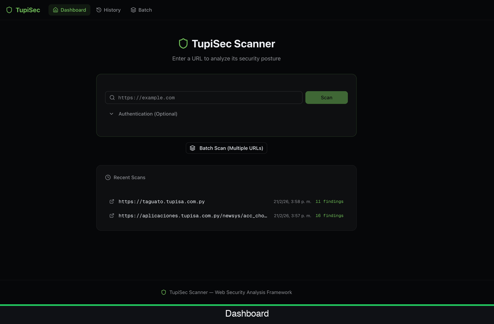
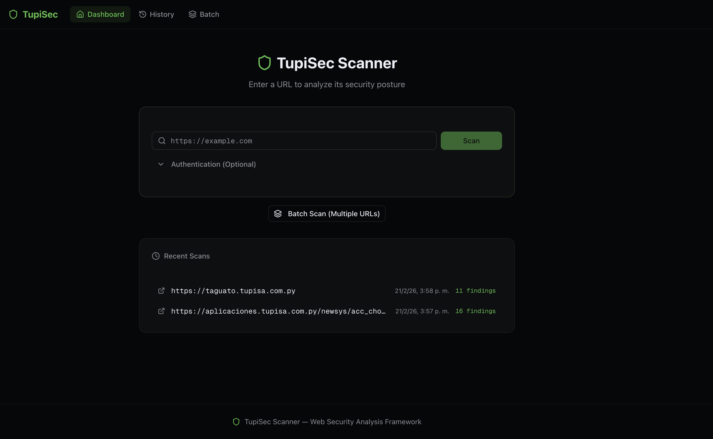
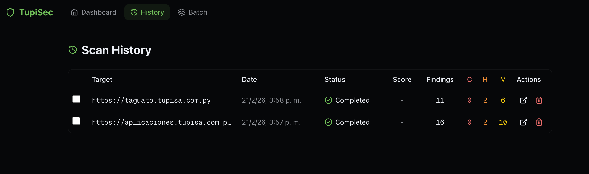
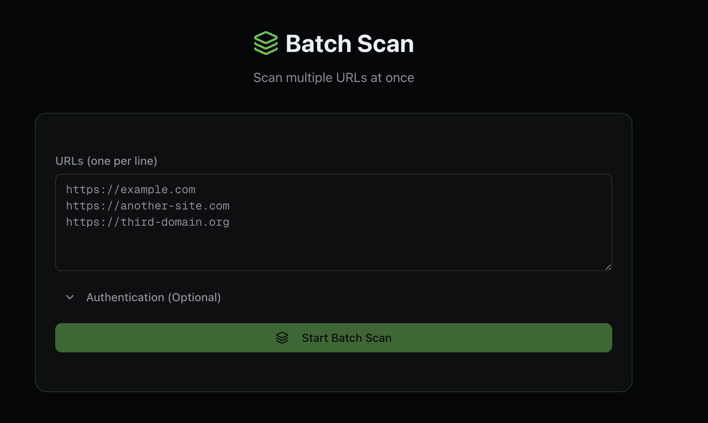
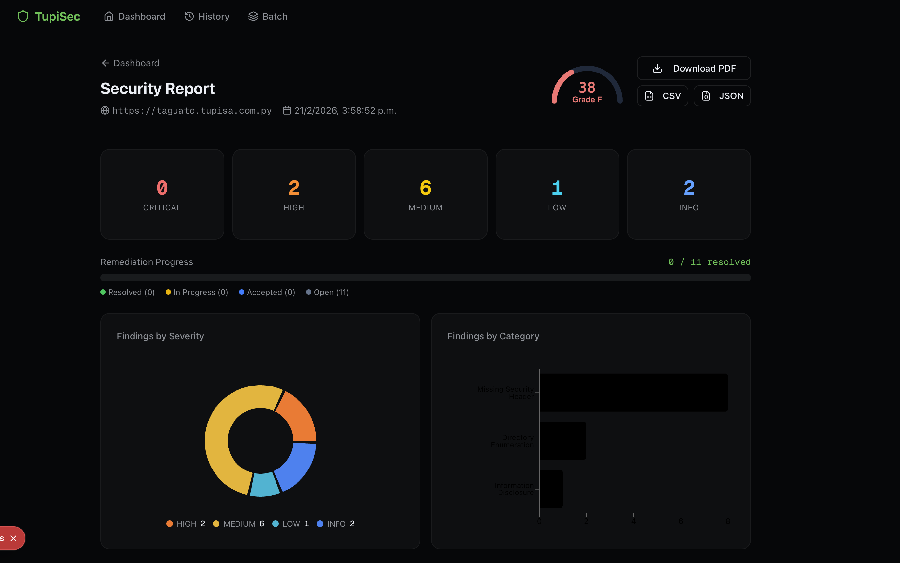

<div align="center">
  <br/>

```
 ████████╗██╗   ██╗██████╗ ██╗███████╗███████╗ ██████╗
 ╚══██╔══╝██║   ██║██╔══██╗██║██╔════╝██╔════╝██╔════╝
    ██║   ██║   ██║██████╔╝██║███████╗█████╗  ██║
    ██║   ██║   ██║██╔═══╝ ██║╚════██║██╔══╝  ██║
    ██║   ╚██████╔╝██║     ██║███████║███████╗╚██████╗
    ╚═╝    ╚═════╝ ╚═╝     ╚═╝╚══════╝╚══════╝ ╚═════╝
```

<h3>Web Security Analysis Framework</h3>
<p>Scanner de vulnerabilidades web con dashboard visual, historial de scans y exportación de reportes PDF</p>

<br/>

[](https://python.org)
[](https://nextjs.org)
[](https://typescriptlang.org)
[](https://sqlite.org)
[](https://tailwindcss.com)
[](LICENSE)

<br/>

</div>

---

## Demo

<div align="center">



</div>

---

## Capturas

<div align="center">

### Dashboard principal



<br/>

<table>
  <tr>
    <td align="center">
      
      <br/><sub><b>Historial de Scans</b></sub>
    </td>
    <td align="center">
      
      <br/><sub><b>Batch Scan</b></sub>
    </td>
  </tr>
</table>

### Reporte de seguridad



</div>

---

## Modulos de escaneo

<table>
  <thead>
    <tr>
      <th>Modulo</th>
      <th>Descripcion</th>
      <th>Severidad</th>
    </tr>
  </thead>
  <tbody>
    <tr>
      <td><b>Security Headers</b></td>
      <td>Detecta ausencia de CSP, HSTS, X-Frame-Options y 7 headers mas</td>
      <td><code>HIGH</code></td>
    </tr>
    <tr>
      <td><b>SSL / TLS</b></td>
      <td>Analiza certificados, protocolos debiles y configuracion HTTPS</td>
      <td><code>CRITICAL</code></td>
    </tr>
    <tr>
      <td><b>SQL Injection</b></td>
      <td>Prueba formularios con 10 payloads reales contra inputs activos</td>
      <td><code>CRITICAL</code></td>
    </tr>
    <tr>
      <td><b>XSS</b></td>
      <td>Inyeccion de scripts en parametros GET y formularios POST</td>
      <td><code>HIGH</code></td>
    </tr>
    <tr>
      <td><b>Directory Traversal</b></td>
      <td>Fuerza bruta de 60+ rutas sensibles (.env, .git, phpinfo, etc.)</td>
      <td><code>HIGH</code></td>
    </tr>
    <tr>
      <td><b>Tech Detection</b></td>
      <td>Identifica frameworks, CMS, servidores y librerias JS</td>
      <td><code>INFO</code></td>
    </tr>
    <tr>
      <td><b>Port Scan</b></td>
      <td>Escaneo de puertos comunes con deteccion de servicios</td>
      <td><code>MEDIUM</code></td>
    </tr>
    <tr>
      <td><b>HTTP Methods</b></td>
      <td>Detecta metodos peligrosos habilitados (PUT, DELETE, TRACE)</td>
      <td><code>HIGH</code></td>
    </tr>
    <tr>
      <td><b>Web Crawler</b></td>
      <td>Rastreo recursivo de URLs internas hasta profundidad configurable</td>
      <td><code>INFO</code></td>
    </tr>
    <tr>
      <td><b>Screenshots</b></td>
      <td>Captura visual de las paginas objetivo via Puppeteer</td>
      <td><code>INFO</code></td>
    </tr>
  </tbody>
</table>

---

## Estructura del proyecto

```
TUPISEC/
├── scanner.py              # Motor principal de escaneo (Python)
├── scan.sh                 # Wrapper CLI para ejecucion rapida
│
├── dashboard/              # Dashboard web (Next.js 15)
│   ├── app/                # App Router
│   │   ├── api/            # API Routes (scan, batch, compare...)
│   │   ├── scan/[id]/      # Vista de reporte individual
│   │   ├── history/        # Historial de escaneos
│   │   ├── batch/          # Batch scan
│   │   └── compare/        # Comparacion de scans
│   ├── components/         # Componentes UI reutilizables
│   ├── lib/                # Scanner bridge, DB, scoring, tipos
│   └── data/               # Base de datos SQLite local
│
├── reports/                # Reportes exportados (.json / .txt)
├── docs/screenshots/       # Capturas del dashboard
├── configs/                # Configuraciones personalizadas
├── scripts/                # Scripts auxiliares
└── tools/                  # Herramientas adicionales
```

---

## Inicio rapido

### Requisitos previos

- Python `3.10+`
- Node.js `18+`
- `pip` y `npm`

### 1 — Clonar el repositorio

```bash
git clone https://github.com/Idod00/TUPISEC.git
cd TUPISEC
```

### 2 — Configurar el scanner (Python)

```bash
python3 -m venv venv
source venv/bin/activate          # Windows: venv\Scripts\activate
pip install requests beautifulsoup4 colorama
```

### 3 — Levantar el dashboard (Next.js)

```bash
cd dashboard
npm install
npm run dev
```

Abre [http://localhost:3000](http://localhost:3000) en tu navegador.

---

## Uso desde CLI

```bash
# Escaneo basico
python3 scanner.py https://ejemplo.com

# Escaneo completo con todos los modulos
python3 scanner.py https://ejemplo.com --full

# Escaneo con reporte guardado
python3 scanner.py https://ejemplo.com --full --output reporte.txt

# Wrapper rapido (activa venv automaticamente)
./scan.sh https://ejemplo.com nombre_opcional
```

---

## Niveles de severidad

| Nivel | Color | Descripcion |
|-------|-------|-------------|
| `CRITICAL` | 🔴 | Explotacion inmediata posible sin autenticacion |
| `HIGH` | 🟠 | Riesgo elevado, requiere atencion urgente |
| `MEDIUM` | 🟡 | Explotable bajo ciertas condiciones |
| `LOW` | 🔵 | Debilidad menor o de bajo impacto |
| `INFO` | ⚪ | Informacion del sistema / contexto |

---

## Stack tecnologico

<div align="center">

| Layer | Tecnologias |
|-------|-------------|
| **Scanner** | Python 3, Requests, BeautifulSoup4, Colorama |
| **Dashboard** | Next.js 15, TypeScript, Tailwind CSS, Shadcn UI |
| **Graficos** | Recharts |
| **Base de datos** | SQLite via better-sqlite3 |
| **Screenshots** | Puppeteer Core |
| **Reportes PDF** | React PDF Renderer |
| **Iconos** | Lucide React |

</div>

---

## Funcionalidades del dashboard

- **Nuevo scan** — lanza el scanner desde el browser con progreso en tiempo real
- **Historial** — todos los scans con filtros, busqueda y ordenamiento
- **Reporte de seguridad** — findings organizados por severidad, score, graficos
- **Comparacion** — compara dos scans del mismo objetivo para ver progreso
- **Batch scan** — escanea multiples URLs en paralelo
- **Export** — descarga reportes en PDF, CSV o JSON
- **Notas en findings** — agrega estado de remediacion y notas por hallazgo
- **Tech stack** — detecta y muestra tecnologias identificadas en el objetivo

---

> [!WARNING]
> **Aviso legal**
> Este framework fue desarrollado con fines educativos y de auditoria autorizada.
> Usarlo contra sistemas **sin permiso explicito** del propietario es ilegal.
> El autor no se hace responsable del uso indebido de esta herramienta.
> **Usar solo en entornos propios o con autorizacion escrita.**

---

<div align="center">
  <sub>Hecho para seguridad defensiva</sub>
</div>
